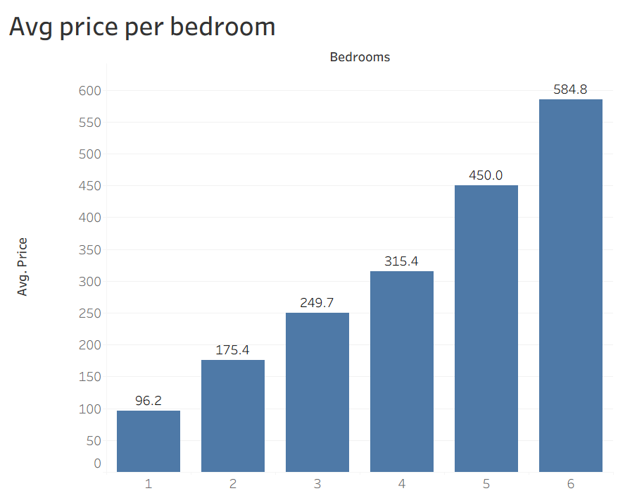
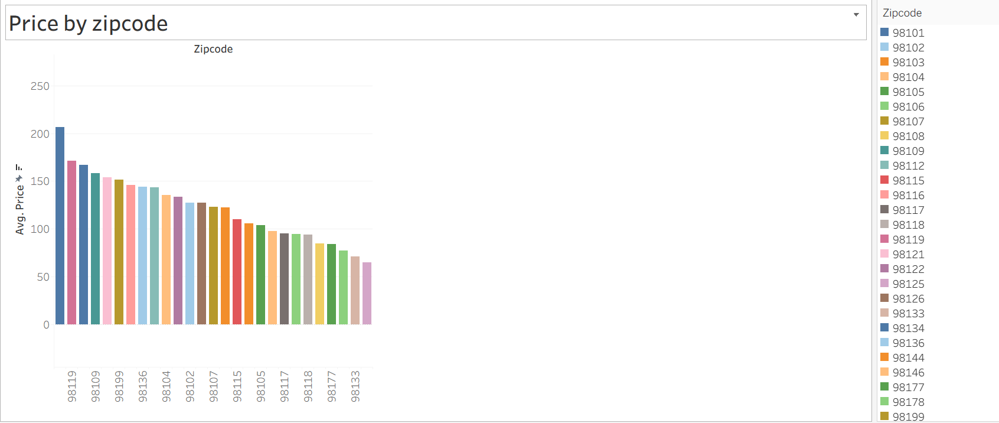
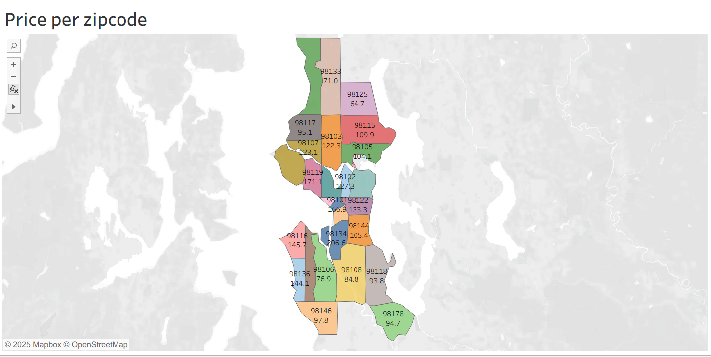
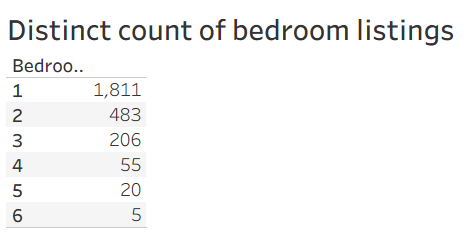
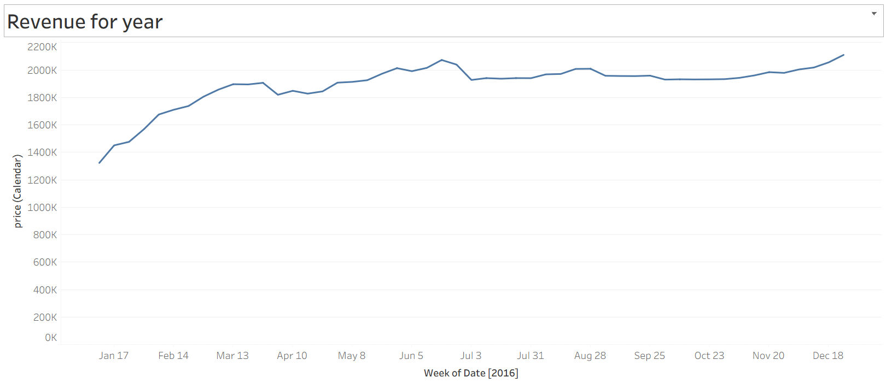

# 🏠 Airbnb Market Analysis – Seattle (Tableau Dashboard)

## 📌 Project overview
This project delivers an interactive Tableau dashboard analyzing Airbnb listings in Seattle, WA. It explores pricing patterns by bedroom count and ZIP code, weekly revenue trends over 2015, and listing availability mix. The goal is to surface location- and property-driven pricing signals for hosts, investors, and analysts.

---

## 🎯 Objectives
- Quantify average price by bedroom count to understand size-based pricing tiers.
- Compare average price across Seattle ZIP codes to reveal location premiums.
- Track weekly price trends to highlight seasonality and demand cycles.
- Summarize inventory mix by bedroom count to understand market depth and offerings.

---

## 📂 Dataset
- Scope: Airbnb listings in Seattle, WA
- Time coverage: 2015 (for the revenue/price-over-time trend)
- Grain: Listing-level metrics, aggregated to Bedroom, ZIP code, and Week
- Key fields (typical): id, name, host_id, zipcode, bedrooms, price, date, availability, review_score
- You provided an Excel dataset and the published dashboard

Note: Dashboard visuals summarize data at aggregated levels (bedroom count, ZIP code, time).

---

## 🛠️ Tools
- Tableau: Data modeling, calculated fields, and dashboard creation
- Excel/CSV: Source data storage and minor prep

---

## 🔧 Data preparation
Performed in Tableau (and light Excel checks):
- Standardized ZIP code to 5-digit format (text) for mapping and grouping.
- Cleaned price to numeric (removed currency symbols and commas).
- Filled sparse bedroom values where safely inferable (rare edge cases only), otherwise excluded.
- Aggregated daily records into weekly time series (ISO week) for trend line.

Example cleaning steps (conceptual):
- Price (numeric): remove “$” and “,” then convert to number
- Week of date: DATETRUNC('week', [date])
- ZIP normalization: STR([zipcode])

---

## 📊 Dashboard features

1) Avg price per bedroom (Bar chart)  
- Insight: Prices increase stepwise as bedrooms increase; market tiers are clearly stratified.  
- Example values (provided):
  - 1 BR: 96.2
  - 2 BR: 175.4
  - 3 BR: 249.7
  - 4 BR: 315.4
  - 5 BR: 450.0
  - 6 BR: 584.8

2) Price per ZIP code (Filled map + bar chart)  
- Insight: Location premium by ZIP; central and high-demand neighborhoods show higher averages.
- ZIPs visualized include: 98102, 98103, 98105, 98106, 98107, 98108, 98109, 98112, 98115, 98116, 98117, 98118, 98119, 98121, 98122, 98125, 98126, 98133, 98136, 98144, 98146, 98148, 98155, 98166, 98168, 98177, 98178, 98188, 98195, 98199.

3) Revenue/price trend by week (2015) (Line chart)  
- Insight: A clear upward trend through 2015, indicating seasonal lift and/or growing demand.

4) Listing mix by bedroom count (KPI list)  
- Insight: Depth of supply by segment, with concentration in 2–3 bedrooms.
  - 1 BR: 199
  - 2 BR: 553
  - 3 BR: 693
  - 4 BR: 494
  - 5 BR: 103
  - 6 BR: 35

---

## 📐 Key calculated fields (Tableau)

- Average price (global or per group)
  - AVG([Price])

- Week of date (for trend)
  - DATETRUNC('week', [Date])

- Bedroom label (clean)
  - IF ISNULL([Bedrooms]) THEN "Unknown"
    ELSE STR([Bedrooms]) + " BR"
    END

- Price bins (optional for distribution views)
  - IF [Price] < 100 THEN "< $100"
    ELSEIF [Price] < 200 THEN "$100–$199"
    ELSEIF [Price] < 300 THEN "$200–$299"
    ELSE "$300+"
    END

- ZIP (as text)
  - STR([zipcode])

---

## 📈 Insights
- Size premium: Average price climbs consistently with bedroom count, suggesting strong, predictable size-based pricing tiers.
- Location premium: Certain ZIP codes command higher average prices, reflecting neighborhood desirability and proximity.
- Seasonality: Weekly trend indicates an upward trajectory through the year, consistent with peak travel seasons and events.
- Inventory: The market is dominated by 2–3 bedroom listings, implying higher competition in mid-tier inventory and potential niches at 4+ bedrooms.

---

## 🧭 How to use the dashboard
- Filters: Use ZIP code and bedroom filters (if available) to focus on target segments.
- Drilldown: Hover tooltips reveal underlying measures and group averages.
- Compare: Use map + bar view to compare neighborhoods, then validate with bedroom split to balance location vs. size.

---

## 📦 Repository structure (suggested)
- /data
  - airbnb-listings-dataset.xlsx (source)
- /images
  - dashboard_overview.png
  - avg_price_by_bedroom.png
  - price_by_zip_map.png
  - weekly_trend.png
- /tableau
  - AirBnB_full_project.twbx (or .twb)

---

## 🚀 How to run
1) Open the Tableau workbook (or connect Tableau to the provided Excel dataset).
2) Ensure fields are correctly typed (ZIP as text, Price as number, Date as date).
3) Refresh extracts if applicable.
4) Interact with the dashboard: filter by ZIP, bedroom count, or time.

---

## 📷 Overview
## Dashboard overview:

## Avg price per bedroom:

## Price per ZIP (map + bars): 

---

## 🔗 Live dashboard
- Tableau Public: https://public.tableau.com/app/profile/kamran.ahmad1470/viz/AirBnBfullproject_17565502981860/Dashboard1
